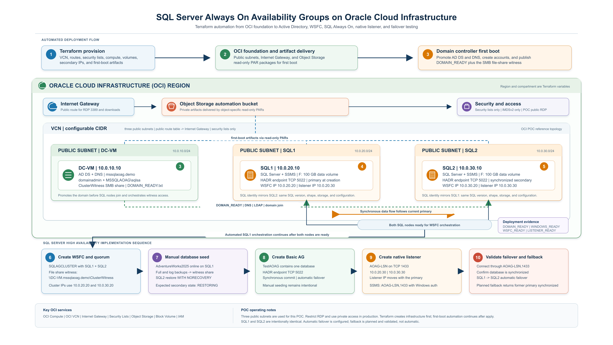

<!-- Copyright (c) 2024, 2026, Oracle and/or its affiliates. All rights reserved. -->
<!-- The Universal Permissive License (UPL), Version 1.0 as shown at https://oss.oracle.com/licenses/upl/ -->
# Automated SQL Server Always On Availability Groups on OCI

## Overview

Microsoft SQL Server high availability projects often require several systems to be configured in the correct order: network connectivity, Active Directory, DNS, Windows Server Failover Clustering, SQL Server, database backup and restore, Always On availability groups, and listener IP addresses. When these steps are performed manually, timing differences between operating-system reboots, domain promotion, service startup, and database restore can produce a cluster that appears online but is not ready for synchronized failover.

This solution automates a two-node SQL Server Always On Availability Group (AOAG) proof of concept on Oracle Cloud Infrastructure (OCI) using Terraform and staged PowerShell first-boot automation. It creates a domain controller, two SQL Server nodes, the OCI network and security controls, SQL storage volumes, WSFC quorum, a manually seeded sample database, a synchronized availability group, and a native multi-subnet availability group listener.

The design is region-neutral. The target region, compartment, Windows image, CIDR ranges, availability domains, instance sizing, database name, listener name, and credentials are supplied through Terraform variables. The current reference configuration is suitable for a controlled POC and is not intended to be a production security baseline without additional hardening.

## Decision Context

The solution is built around four automation layers:

### OCI Infrastructure Layer

Terraform provisions the repeatable OCI foundation:

- One VCN with configurable CIDR ranges.
- Three separate public subnets for `DC-VM`, `SQL1`, and `SQL2`.
- One public route table with an Internet Gateway route.
- Security lists only; no NSGs are required by this implementation.
- Public IPs for RDP and first-boot software downloads.
- Secondary private IP reservations for WSFC and the AOAG listener.
- One 100 GB paravirtualized block volume for each SQL node.
- A private Object Storage bucket containing the PowerShell automation artifacts.
- Object-specific, read-only pre-authenticated requests for first-boot downloads.

The default placement uses the first availability domain for `DC-VM` and `SQL1`, and the second availability domain for `SQL2` when the region exposes one. In regions with a single availability domain, all instances use that domain. Explicit availability-domain overrides are supported.

### Windows and Active Directory Layer

`DC-VM` installs AD DS and DNS, promotes the first domain controller, creates the configured domain administrator and SQL service account, and publishes the file-share witness used by WSFC.

`SQL1` and `SQL2` set their local bootstrap credentials, enable RDP, configure DNS to use the domain controller, join the domain, and add the domain administrator to the local Administrators and Remote Desktop Users groups.

### SQL and WSFC Layer

The SQL nodes install SQL Server and SSMS when enabled, configure SQL Server and SQL Server Agent to use the dedicated domain service account, install Failover Clustering, configure the HADR endpoint on TCP 5022, and enable Always On availability groups.

SQL1 creates `SQLAGCLUSTER` with two subnet-specific cluster IPs and configures the file-share witness on `DC-VM`. The cluster computer object permissions needed for the WSFC name are granted in Active Directory by the automation.

### Database and AOAG Layer

The sample database is seeded with the documented backup/restore method:

1. SQL1 restores the sample database online.
2. SQL1 creates full and transaction-log backups on the witness share.
3. SQL2 restores those backups with `NORECOVERY`.
4. The availability group is created with manual seeding, synchronous commit, and automatic failover for the two SQL replicas.
5. The secondary joins the availability group and the database becomes synchronized.
6. The native listener is created and verified with both subnet listener IPs.

Manual seeding is intentional. It makes the backup, restore, and `NORECOVERY` stages visible for POC testing and avoids relying on automatic database seeding.

## Reference Architecture



The PNG follows the actual execution order: Terraform provisions OCI, `DC-VM` is created and promoted first, SQL1 and SQL2 are created next, the SQL nodes join the domain, SQL runs under `MSSQLAOAG\\sqlsa`, SQL Server and SSMS are installed, WSFC and the file-share witness are configured, the sample database is backed up and restored with `NORECOVERY`, the AOAG is configured and synchronized, and only then is `AOAG-LSN` created and failover readiness validated. This POC uses a native SQL Server listener and does not use an OCI Load Balancer.

For official OCI service stencils and templates, use Oracle's [OCI Architecture Diagram Toolkit](https://docs.oracle.com/en-us/iaas/Content/General/Reference/graphicsfordiagrams.htm). The published architecture artifact for this repository is the PNG above.

## End-to-End Flow

### 1. Terraform Input and OCI Provisioning

The operator copies `terraform.tfvars.example` to `terraform.tfvars`, supplies the target region, `OICCompartment` OCID, Windows image OCID, CIDRs, sizing, and sensitive credentials, then runs Terraform.

Terraform creates the VCN, Internet Gateway, public route table, public subnets, security lists, instances, block volumes, secondary private IPs, and private automation artifacts. Instance metadata disables the legacy OCI metadata endpoints, making the instances IMDSv2-only.

### 2. Domain Controller Bootstrap

The DC first-boot task:

- Resets and enables the local `Administrator` and `opc` accounts for bootstrap access.
- Renames the server to `DC-VM`.
- Installs AD DS, DNS, and management tools.
- Promotes the first domain controller for the configured DNS domain.
- Creates the domain administrator and dedicated SQL service account.
- Creates `C:\ClusterWitness` and publishes `\\DC-VM.<domain>\\ClusterWitness`.
- Verifies the domain after the promotion reboot.

Readiness marker:

```text
C:\AOAGAutomation\DC\DOMAIN_READY.txt
```

### 3. SQL Node Bootstrap

Each SQL node waits for the domain controller to answer DNS and LDAP queries before attempting the domain join. The node then:

- Resets and enables local `Administrator` and `opc`.
- Enables RDP and the required Windows firewall rules.
- Renames the computer to `SQL1` or `SQL2`.
- Sets the DC as the DNS server and joins the domain.
- Grants the domain administrator local administrator and RDP access.
- Installs SQL Server 2025 and SSMS when enabled.
- Formats and mounts its 100 GB data volume as `F:`.
- Creates `F:\SQLData`, `F:\SQLLogs`, and the required access permissions.
- Configures SQL Server and SQL Server Agent to use the dedicated SQL service account.
- Installs WSFC prerequisites and enables Always On.

Readiness marker on each node:

```text
C:\AOAGAutomation\Windows\WINDOWS_BOOTSTRAP_READY.txt
```

### 4. WSFC and Quorum

SQL1 orchestrates the WSFC stage after SQL1 and SQL2 are available. The automation:

- Installs or confirms Failover Clustering on both SQL nodes.
- Creates `SQLAGCLUSTER` with the configured cluster IP on each SQL subnet.
- Grants the cluster computer object the required Active Directory permissions.
- Configures the file-share witness on `DC-VM`.
- Enables the SQL Always On feature on both SQL Server services.
- Starts the HADR endpoint on TCP 5022.

Readiness markers and checks:

```text
C:\AOAGAutomation\WSFC\WSFC_READY.txt
C:\AOAGAutomation\WSFC\TASK_5_1_AD_PERMISSION_READY.txt
C:\AOAGAutomation\WSFC\TASK_5_2_ALWAYS_ON_READY.txt
```

### 5. Database Backup and Restore

The configured sample database, `AdventureWorks2025` by default, is downloaded on SQL1 from the configured Microsoft sample URL. SQL1 restores it online, changes it to the FULL recovery model, and writes full and transaction-log backups to:

```text
\\DC-VM.<domain>\\ClusterWitness\\SampleBackups
```

SQL2 receives the same backup files through the witness share and restores the database with `NORECOVERY`. At this point, `RESTORING` on SQL2 is expected. SQL2 becomes queryable only after it is joined to the availability group and synchronization completes.

Readiness markers:

```text
C:\AOAGAutomation\WSFC\TASK_5_3_PRIMARY_READY.txt
C:\AOAGAutomation\WSFC\TASK_5_3_SECONDARY_READY.txt
```

### 6. Availability Group and Listener

The availability-group automation creates or confirms the HADR endpoint and then creates `TestAOAG` with:

| Setting | SQL1 | SQL2 |
| --- | --- | --- |
| Replica role at creation | Primary | Secondary |
| Availability mode | Synchronous commit | Synchronous commit |
| Failover mode | Automatic | Automatic |
| Seeding mode | Manual | Manual |
| HADR endpoint | TCP 5022 | TCP 5022 |

After SQL2 joins and the database is synchronized, the automation creates the native listener:

| Listener setting | Value |
| --- | --- |
| DNS name | `AOAG-LSN.<domain>` |
| Port | `1433` by default |
| SQL1 subnet IP | Configured by `aoag_listener_ip_sql1` |
| SQL2 subnet IP | Configured by `aoag_listener_ip_sql2` |

The listener is a multi-subnet SQL Server listener. It is created as an availability-group resource, not as an OCI Load Balancer. The listener creation step is retried and verified before the readiness marker is published.

Readiness markers:

```text
C:\AOAGAutomation\WSFC\TASK_5_4_AVAILABILITY_GROUP_READY.txt
C:\AOAGAutomation\WSFC\TASK_5_5_LISTENER_READY.txt
```

## Key Components

### Terraform Resources

| Area | Terraform implementation |
| --- | --- |
| Provider | OCI provider configured from the selected OCI profile and region |
| Network | VCN, Internet Gateway, public route table, three public subnets |
| Compute | Windows `DC-VM`, `SQL1`, and `SQL2` instances using a configurable Flex shape |
| Availability domains | Automatic first/second AD selection with optional overrides |
| Storage | One 100 GB block volume per SQL node, mounted as `F:` |
| Private IPs | WSFC cluster IPs and two-subnet AOAG listener IPs |
| Security | OCI security lists; no NSGs in this implementation |
| Automation delivery | Private Object Storage bucket and object-specific PARs |
| Instance security | Legacy IMDS endpoints disabled on all three instances |

### PowerShell Use Cases

| Script | Responsibility |
| --- | --- |
| `scripts/dc/01-configure-domain-controller.ps1` | AD DS, DNS, accounts, witness share, and DC readiness |
| `scripts/sql/02-configure-sql-node.ps1` | Local access, domain join, SQL installation, storage, firewall, and Always On prerequisites |
| `scripts/wsfc/03-configure-wsfc.ps1` | WSFC creation, AD permissions, quorum, Always On, and orchestration |
| `scripts/aoag/04-prepare-sample-database.ps1` | Sample database restore, backups, and SQL2 `NORECOVERY` restore |
| `scripts/aoag/05-configure-availability-group.ps1` | HADR endpoint, AG, replica synchronization, automatic failover, and listener |
| `scripts/aoag/06-safe-planned-failover.ps1` | Guarded planned failover and failback |
| `scripts/aoag/07-reconcile-availability-group.ps1` | Startup reconciliation after reboot, cluster recovery, and listener verification |

## Network and Security Design

The reference network uses one VCN and three separate public subnets. All three subnets use the public route table and Internet Gateway so the VMs can be reached by RDP and can download Windows and SQL installation media during the POC.

The security lists permit domain, SMB witness, WinRM, WSFC, SQL Server, and HADR traffic from the VCN CIDR. RDP is controlled separately by `dc_rdp_source_cidr` and `sql_rdp_source_cidr`. The example values allow `0.0.0.0/0` for lab convenience; production deployments should replace them with a trusted administrator CIDR or use a private access path.

The following ports are central to the workflow:

| Port | Purpose |
| --- | --- |
| 3389/TCP | RDP administration |
| 53/TCP and UDP | DNS |
| 88/TCP and UDP | Kerberos |
| 389/TCP and UDP | LDAP |
| 445/TCP | SMB and file-share witness |
| 1433/TCP | SQL Server and AOAG listener |
| 3343/TCP and UDP | WSFC cluster service |
| 5022/TCP | SQL Server Always On HADR endpoint |
| 5985/5986 TCP | WinRM for domain-admin orchestration |
| 49152-65535/TCP | Windows dynamic RPC |

No NSGs, bastion host, OCI Load Balancer, NAT Gateway, Service Gateway, or
Service Gateway-based private software repository is included in this
reference build. These are deliberate POC boundaries and can be added as a
separate production-hardening phase.

## Operations and Validation

Terraform resource creation and Windows bootstrap are asynchronous. When Terraform prints the instance public IPs, the OCI layer is ready, but the Windows configuration may still be running. Allow at least 10-15 minutes after the IPs appear, and allow additional time for DC promotion and SQL/SSMS downloads.

Use the readiness markers rather than elapsed time alone:

```powershell
# DC-VM
Get-Content C:\AOAGAutomation\DC\DOMAIN_READY.txt

# SQL1 and SQL2
Get-Content C:\AOAGAutomation\Windows\WINDOWS_BOOTSTRAP_READY.txt

# SQL1
Get-Content C:\AOAGAutomation\WSFC\WSFC_READY.txt
Get-ClusterNode -Cluster SQLAGCLUSTER
Get-ClusterQuorum -Cluster SQLAGCLUSTER

# Both SQL nodes
Get-Content C:\AOAGAutomation\WSFC\TASK_5_4_AVAILABILITY_GROUP_READY.txt
Get-Content C:\AOAGAutomation\WSFC\TASK_5_5_LISTENER_READY.txt
```

Listener checks:

```powershell
sqlcmd -E -C -S localhost -Q "
SELECT l.dns_name,
       l.port,
       CONVERT(varchar(50), ip.ip_address) AS listener_ip
FROM sys.availability_group_listeners AS l
JOIN sys.availability_group_listener_ip_addresses AS ip
  ON l.listener_id = ip.listener_id
WHERE l.dns_name = 'AOAG-LSN';
"

nslookup AOAG-LSN.mssqlaoag.demo
Test-NetConnection AOAG-LSN.mssqlaoag.demo -Port 1433
```

AOAG health query:

```sql
SELECT
    ar.replica_server_name,
    ars.role_desc,
    ars.connected_state_desc,
    drs.database_state_desc,
    drs.synchronization_state_desc,
    drs.synchronization_health_desc,
    drs.is_suspended,
    drs.suspend_reason_desc,
    drs.log_send_queue_size,
    drs.redo_queue_size
FROM sys.dm_hadr_database_replica_states AS drs
JOIN sys.availability_replicas AS ar
  ON drs.replica_id = ar.replica_id
JOIN sys.dm_hadr_availability_replica_states AS ars
  ON ars.replica_id = ar.replica_id
WHERE drs.database_id = DB_ID(N'AdventureWorks2025');
```

### Planned Failover and Failback

Use the domain account `MSSQLAOAG\\domainadmin` with Windows Authentication. The SQL service account `MSSQLAOAG\\sqlsa` is a service identity and should not be used for interactive testing. The local `opc` account is useful for Windows administration but is not the preferred account for AOAG operations.

For a no-data-loss planned failover, confirm the target secondary is connected, synchronous, synchronized, healthy, online, and not suspended. Then run the guarded failover script on the target secondary:

```powershell
powershell.exe -ExecutionPolicy Bypass -File C:\AOAGAutomation\WSFC\06-safe-planned-failover.ps1
```

After SQL2 becomes primary, wait for SQL1 to return as `ONLINE`, `SYNCHRONIZED`, and `HEALTHY`. Run the same guarded script from SQL1 to fail back. A planned failover should not leave the database in `RESTORING`; `RESTORING` is expected only during the manual SQL2 seed before AG join. An unplanned VM shutdown can temporarily place the former primary in `REVERTING` or `RECOVERING` during crash recovery.

This is a single-primary AOAG design. Both replicas participate in availability, but both do not accept independent writes at the same time. Automatic failover is available only when the configured synchronous replica is healthy and the WSFC has quorum.

## Deployment

### Local Terraform CLI

Use the local workflow only when the environment will be owned by Terraform on the workstation. Install Terraform, configure an authorized OCI CLI profile in `~/.oci/config`, and use a Windows image OCID from the same region specified by `region`. Keep `execution_environment = "local"` and set `oci_config_profile` to that local profile in `terraform.tfvars`.

Local Terraform and OCI Resource Manager have separate state. Do not use a local `terraform apply` against a Resource Manager-created stack. Destroy the Resource Manager stack first, or deploy the local test into a different compartment with unused CIDRs and static IPs.

```bash
cd <cloned-repository-directory>
cp terraform.tfvars.example terraform.tfvars

# Review terraform.tfvars before applying. Replace every placeholder beginning
# with REPLACE_, keep intentionally blank values blank unless their comments
# say otherwise, and adjust example defaults when required. Confirm that the
# region and windows_image_ocid match, then choose one credential method below.
# Do not use both methods for the same variable.

# Option A: Prefer environment variables.
export TF_VAR_domain_admin_password='<domain-admin-password>'
export TF_VAR_windows_admin_password='<local-windows-password>'
export TF_VAR_sql_service_account_password='<sql-service-account-password>'

# Option B: Uncomment the password settings in the local, gitignored
# terraform.tfvars file. Empty Windows and SQL service password values reuse
# domain_admin_password for this POC.

terraform init
terraform plan
terraform apply
```

### OCI Resource Manager deployment

The same Terraform can be deployed through an OCI Resource Manager stack. Create the stack from the Git repository or a clean ZIP of this directory, set `execution_environment = "resource_manager"`, and provide the target region, compartment, Windows image, network values, and passwords through the Stack variables page. Resource Manager supplies OCI authentication and manages state, so users do not run `terraform init` or set `TF_VAR_*` shell variables for this deployment path.

Resource Manager is an alternative deployment owner, not an extension of a local deployment. Do not switch deployment methods for the same resources unless the original owner has destroyed its stack.

Do not upload `.terraform`, `terraform.tfstate*`, `terraform.tfvars`, plans, or logs. Run a Resource Manager **Plan** job, then an **Apply** job after review; use a **Destroy** job for cleanup. The stack operator requires compartment permissions to manage networking, compute, block volumes, private IPs, and the Object Storage automation artifacts. Treat stack state and job logs as sensitive because the bootstrap uses account passwords.

The same directory can be used for a clean POC recreation:

```bash
terraform destroy
terraform apply
```

Do not delete `terraform.tfstate` before `terraform destroy`; the state file is how Terraform tracks the OCI resources it must remove. Treat Terraform state, rendered metadata, local `terraform.tfvars`, and first-boot logs as sensitive because the bootstrap process handles credentials.

## Scope and Extension Points

Included in this reference implementation:

- Region-neutral Terraform inputs.
- Three public subnets and public RDP access for a POC.
- Domain controller and SQL node first-boot automation.
- WSFC with a file-share witness on the domain controller.
- Manual backup/restore seeding with `NORECOVERY`.
- Synchronous SQL1/SQL2 AOAG with automatic failover.
- Native multi-subnet AOAG listener.
- Separate SQL block volumes and IMDSv2-only instance configuration.
- Startup reconciliation after VM restart.

Out of scope for this document:

- OCI Load Balancer integration.
- Bastion-based private administration.
- Chicago or another-region DR replica.
- A secondary domain controller in another region.
- Backup retention, encryption-key lifecycle, monitoring dashboards, and production patch governance.
- Multi-primary write scale-out.

These can be added as follow-on designs without changing the core domain, WSFC, or AOAG sequencing model.

## Reference Implementation

This repository is a POC-oriented Terraform implementation of the Oracle SQL Server AOAG tutorial pattern. It packages the infrastructure and the Windows post-provisioning steps into a repeatable deployment so that a team can recreate the environment, inspect each readiness stage, connect through the native listener, and demonstrate planned failover and failback with synchronized database replicas.
